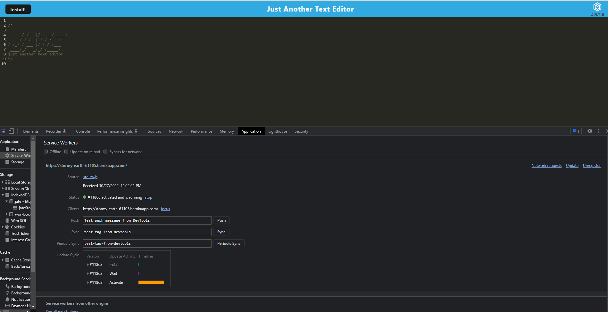
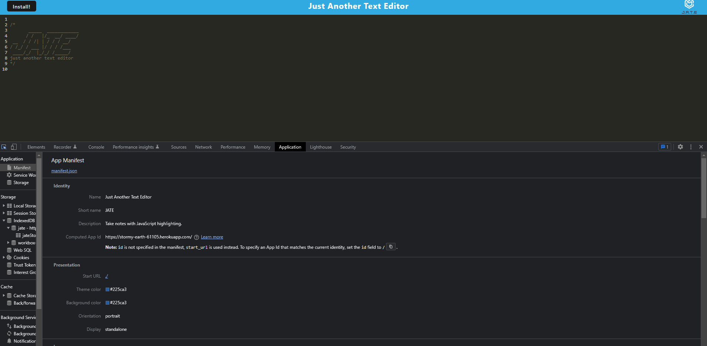
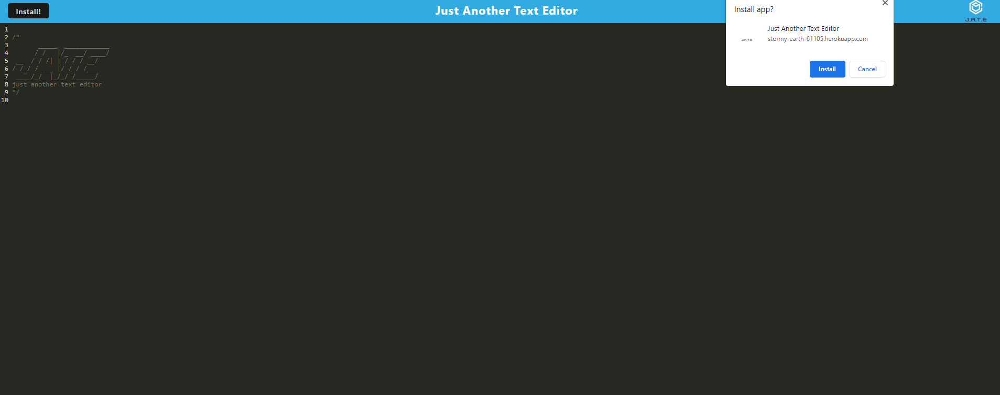
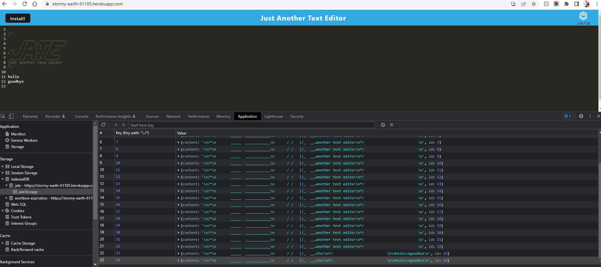

# PWA-Text-Editor

[Live Link](https://stormy-earth-61105.herokuapp.com/)

For this project we learned how to create a PWA that a user can install onto their local machine and access offline. We also learned how to use a bundler to serve our application to the user. We were successfully able to implement a Service Worker and a Manifest so that users can use this application offline. 

## Installation

Right click the root level 'package.json' file and click 'Open in Integrated Terminal' then type the following in your terminal to install the neccessary packages:
```
npm i
```

## Usage 

In the same terminal on the root path, type the following command to run the back-end server and front-end concurrently: 
```
npm run start
```
Below is a screenshot of Service Worker successfully registered for the application:


Below is a screenshot of Manifest successfully able to be installed to local machine:


Below is a screenshot of Install button working properly:


Below is a screenshot of user input being stored into IndexedDB:


## License

Refer to the license file.
